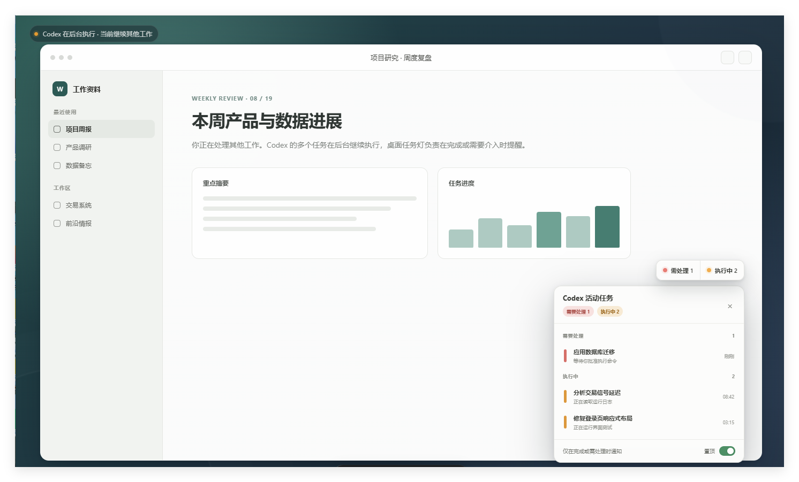

# UI Design Lab

[](https://github.com/Yueyuyu/ui-design-lab/releases/latest)

一个“单仓库、多套系、强隔离”的 UI 设计系统实验室。每套视觉系统拥有独立的 Token、组件、模式、规范、资产和版本边界；只有 Gallery 与构建工具可以共享。

当前公开版本为 [`v0.3.0`](https://github.com/Yueyuyu/ui-design-lab/releases/tag/v0.3.0)。

## 仓库定位

这个仓库不是单个产品页面，也不是一组彼此混用的样式片段。它用于：

- 将一套经过确认的视觉语言沉淀为可复用的设计系统；
- 在 Gallery 中集中查看 Token、组件、状态、密度和页面模式；
- 让后续项目按明确边界复用，而不是每个项目重新决定颜色、字体、图标和动效；
- 允许未来新增完全不同的视觉套系，同时避免套系之间互相污染。

## Suite 01 · Quiet Workspace / 静谧工作台

Quiet Workspace 是一套 light-first、Windows-friendly 的效率工具视觉系统，适合需要长时间阅读、监控和处理信息的桌面应用。它把温润编辑感、克制的工具属性与轻量桌面原生感结合在一起。



### 视觉语言

| 维度 | 标准 |
|---|---|
| 风格 | 安静、温润、克制，以内容和排版建立层级，减少无意义卡片 |
| 表面 | 暖白纸张、纯白强表面和浅灰绿弱表面，不把深色桌面背景当成产品表面 |
| 主色 | 低饱和鼠尾草绿；提醒、执行中、成功和离线使用克制的语义色 |
| 字体 | `Segoe UI Variable`、`Segoe UI`、`Microsoft YaHei UI`、`system-ui`、`sans-serif` |
| 字号 | 辅助文字不低于 11px；控件标签和关键紧凑信息不低于 12px；正文默认 14px |
| 轮廓 | 细边线、柔和圆角与轻阴影；通过间距、边线和文字层级保持清楚 |
| 密度 | `comfortable` 用于常规工作台；`compact` 用于任务灯、监控列表和高频浮层 |
| 动效 | 140–180ms 的短促缓出反馈；不使用持续漂浮或无意义循环动画 |

准确色值、间距、圆角、字号和动效参数以 [tokens.json](systems/quiet-workspace/foundations/tokens.json) 与 [tokens.css](systems/quiet-workspace/foundations/tokens.css) 为准。

### 参考图片是做什么的

[`references/quiet-workspace-source.png`](references/quiet-workspace-source.png) 是 Quiet Workspace 的视觉母版，用于校准：

- 整体构图、内容密度和留白关系；
- 中英文字体、字号和信息层级；
- 面板、胶囊、任务灯的圆角、边线、阴影和状态语言；
- Gallery 中各页面是否仍然属于同一套视觉系统。

它不是需要逐像素复制的产品页面，也不是完整组件清单。图片中的深色渐变桌面只是展示场景，只能放在 Gallery；它不属于核心 UI Token，业务产品也不应自动继承该背景。

### 组件、状态与专项规范

当前已覆盖：

- Button、IconButton、Field、Select、Toggle；
- Card、Dialog、Table；
- Notification、EmptyState；
- StatusChip、BarChart、TaskLight、QuotaPill、WorkspacePreview。

每个可复用组件都必须定义 `default`、`hover`、`pressed`、`focus`、`disabled`、`loading` 和 `error` 七种状态。结构化状态契约位于 [interaction-states.json](systems/quiet-workspace/foundations/interaction-states.json)。

完整规范：

- [套系总说明](systems/quiet-workspace/README.md)
- [可访问性](systems/quiet-workspace/standards/accessibility.md)
- [组件状态](systems/quiet-workspace/standards/component-states.md)
- [图标](systems/quiet-workspace/standards/icons.md)
- [数据图表](systems/quiet-workspace/standards/data-visualization.md)
- [中文文案](systems/quiet-workspace/standards/chinese-copy.md)
- [动效](systems/quiet-workspace/standards/motion.md)
- [状态语义与额度胶囊](systems/quiet-workspace/standards/status-semantics.md)

## 复用边界

Quiet Workspace 的命名空间为：

- 套系 ID：`quiet-workspace`
- CSS 作用域：`[data-ui-system="quiet-workspace"]`
- Token 前缀：`--qw-`
- 组件类名前缀：`.qw-`

可复用代码放在 `systems/quiet-workspace/`；Gallery 位于 `src/`，只负责展示和组合。不同套系不得引用彼此的 Token、组件、模式或视觉资产。

## 本地运行

```powershell
git clone https://github.com/Yueyuyu/ui-design-lab.git
cd .\ui-design-lab
npm install
npm run dev
```

完整检查：

```powershell
npm run check
npm run test:sites
```

## 新增视觉套系

1. 在 `systems/<suite-id>/` 建立独立目录。
2. 为 Token、类名和组件使用独立前缀。
3. 将全部 CSS 限定在独立的 `data-ui-system` 作用域内。
4. 不引用其他套系的 Token、组件、模式或视觉资产。
5. 只在 `src/` 的 Gallery 中注册展示入口。

## 版本规则

项目使用 [Semantic Versioning](https://semver.org/lang/zh-CN/)：

- `MAJOR`：套系契约或公共组件 API 出现不兼容变更；
- `MINOR`：向后兼容地新增 Token、组件、规范或 Gallery 能力；
- `PATCH`：向后兼容的问题修复、文档完善或视觉微调。

根目录 [`VERSION`](VERSION) 是人和自动化读取的项目版本；它与 `package.json`、`package-lock.json`、套系 Token 和状态契约中的版本保持一致。正式版本使用 `vX.Y.Z` Git Tag，并在 [GitHub Releases](https://github.com/Yueyuyu/ui-design-lab/releases) 中记录变化。

历史变化见 [CHANGELOG.md](CHANGELOG.md)。
